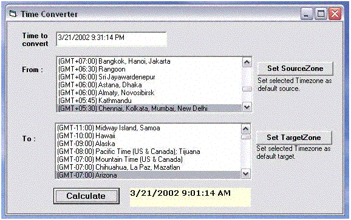



## Time Converter

### Description

To convert time from one timezone to another.
 
### More Info
 
Time to be converted

Self-explained code

Converted time is displayed

             |
---                |---
**Submitted On**   |2002-03-21 21:08:54
**By**             |[copaoflife](https://github.com/Planet-Source-Code/PSCIndex/blob/master/ByAuthor/copaoflife.md)
**Level**          |Intermediate
**User Rating**    |4.9 (34 globes from 7 users)
**Compatibility**  |VB 5\.0, VB 6\.0
**Category**       |[Complete Applications](https://github.com/Planet-Source-Code/PSCIndex/blob/master/ByCategory/complete-applications__1-27.md)
**World**          |[Visual Basic](https://github.com/Planet-Source-Code/PSCIndex/blob/master/ByWorld/visual-basic.md)
**Archive File**   |[Time\_Conve643773222002\.zip](https://github.com/Planet-Source-Code/copaoflife-time-converter__1-32941/archive/master.zip)

### API Declarations

uses win32api... view code for more details

